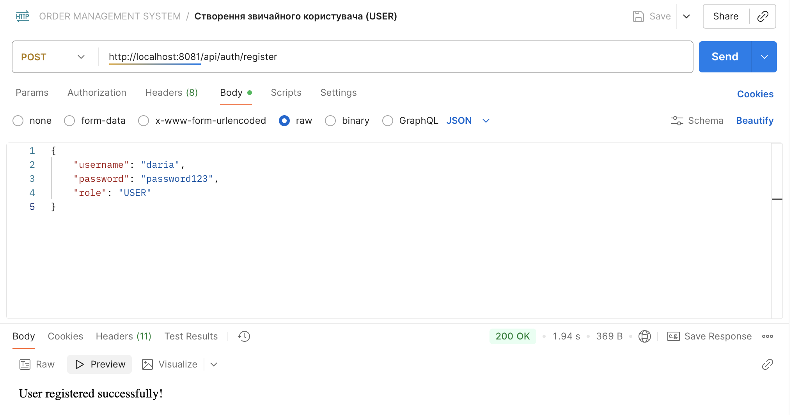
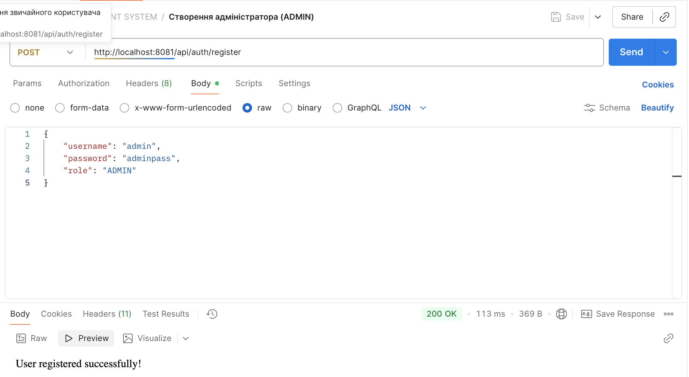
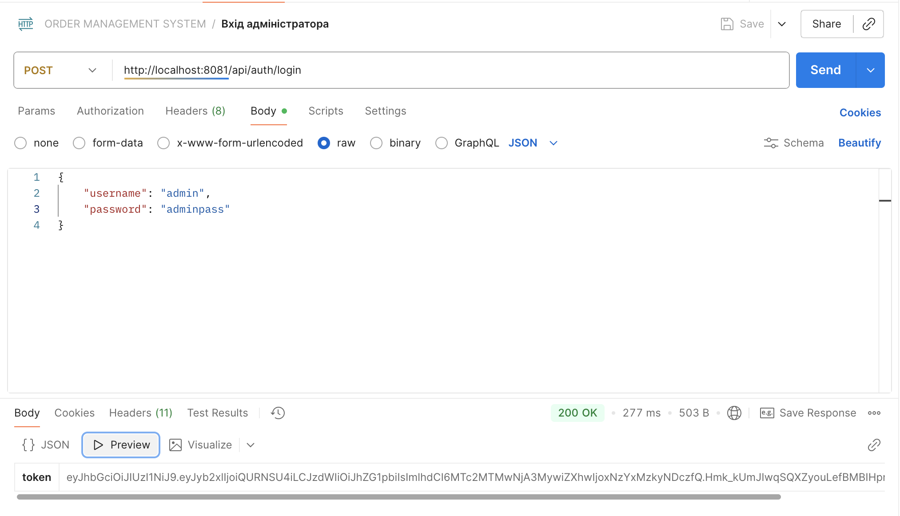
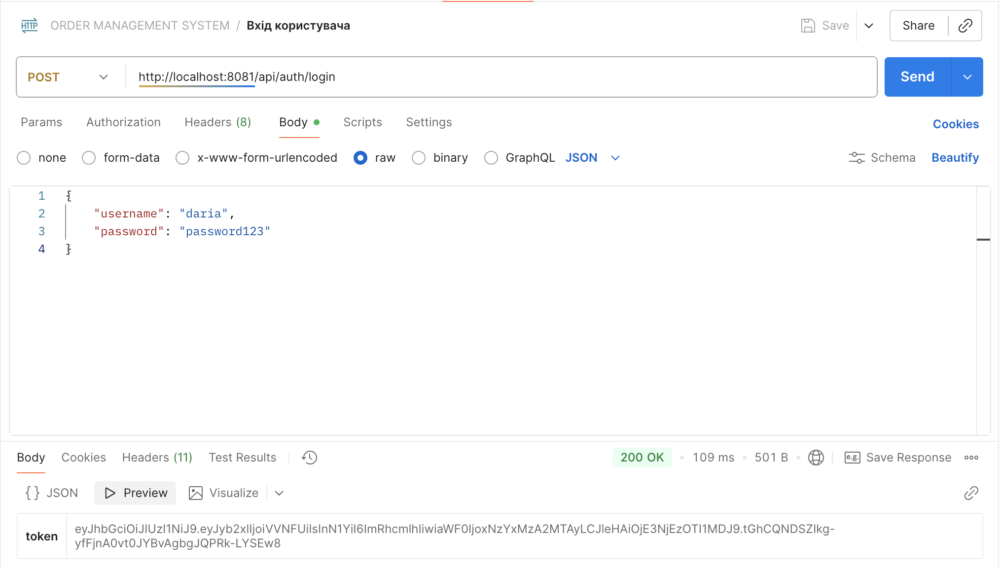
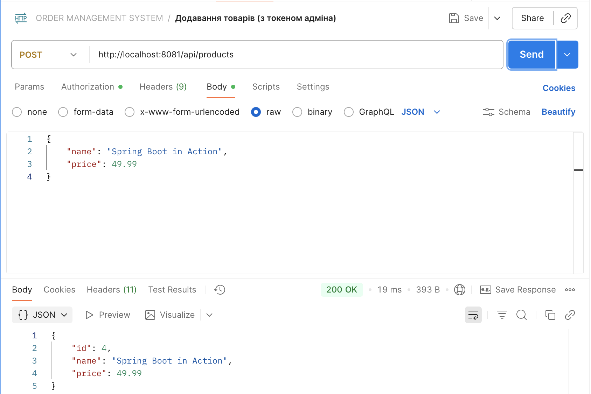
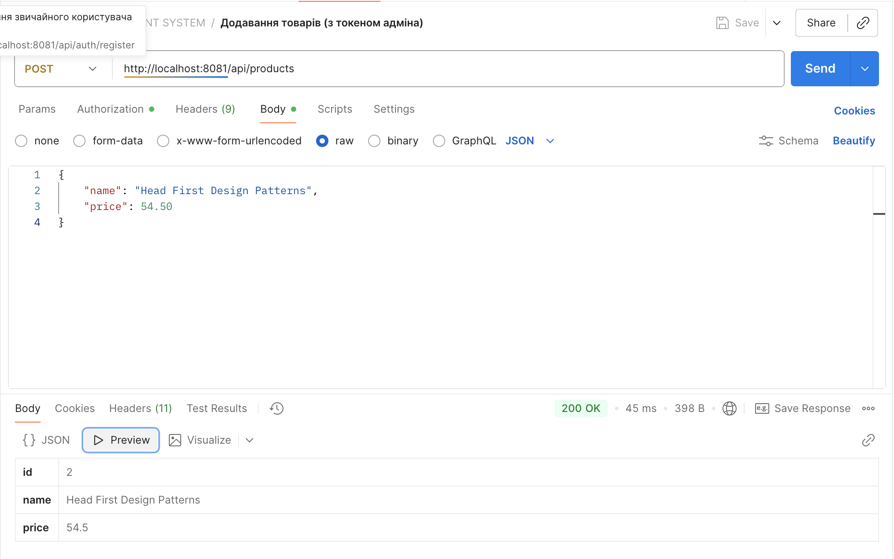
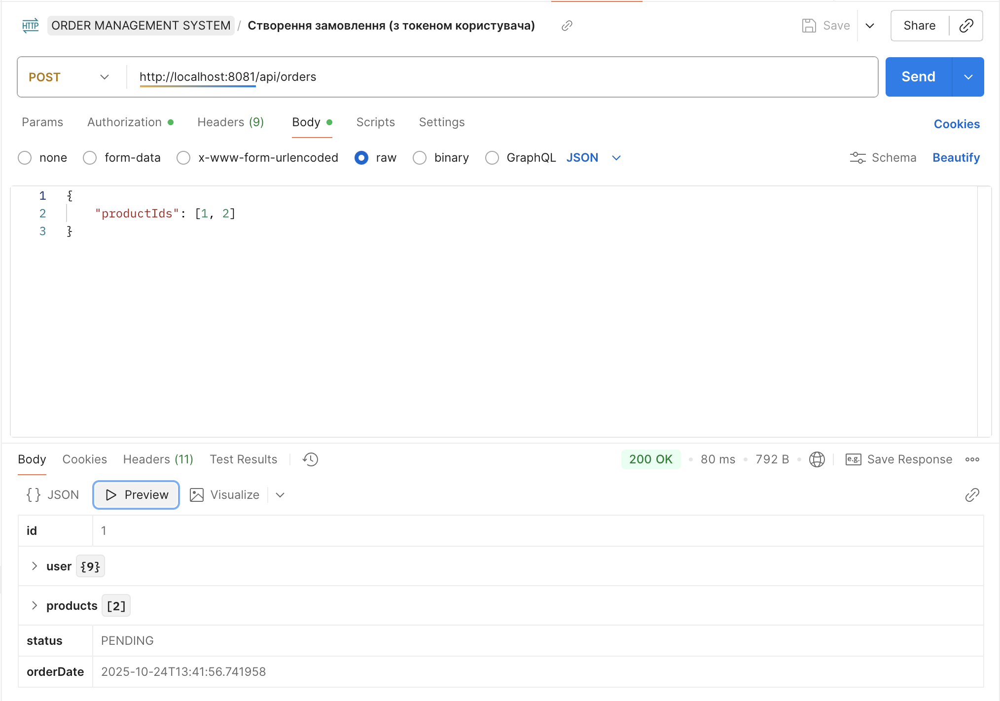
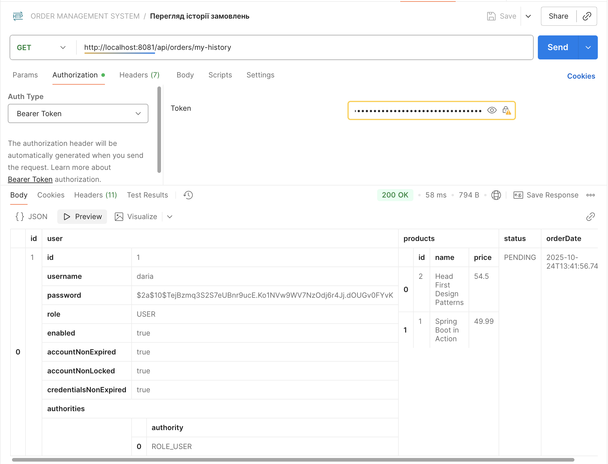
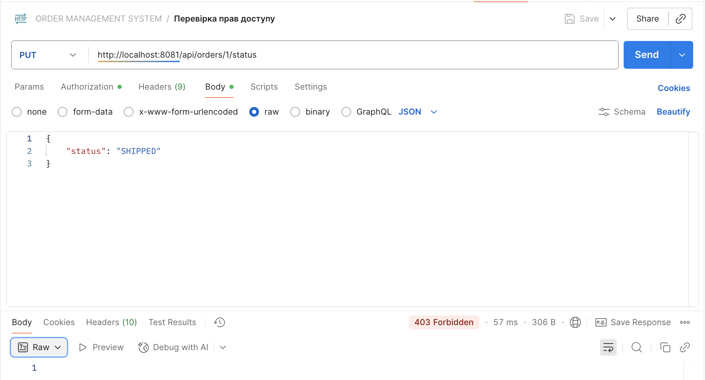
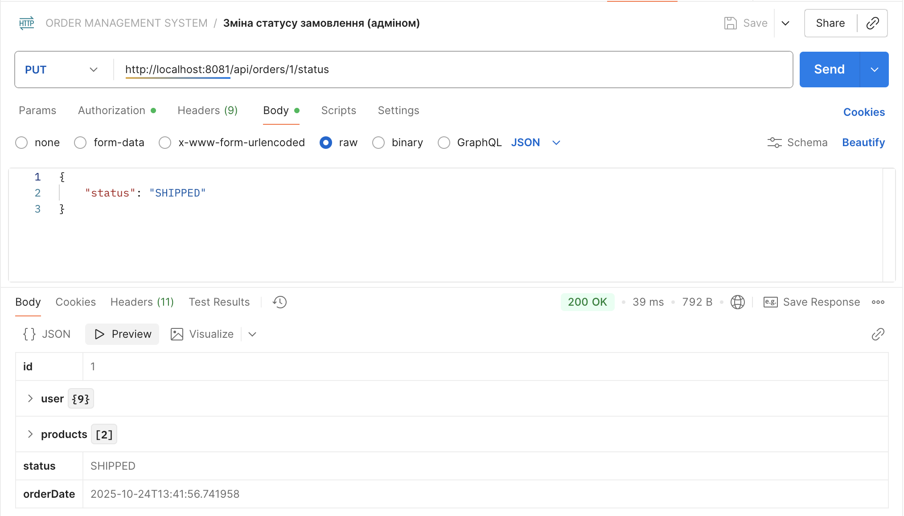

## Звіт до лабораторної роботи №2
### Тема: "Робота з даними, введення та виведення, обробка помилок"
### Мета роботи: Ознайомитись із розширеними можливостями роботи з даними у Spring, навчитись працювати з введенням, виведенням та обробкою помилок, реалізувати безпеку в Spring-додатках за допомогою Spring Security та JWT, освоїти основи Spring MVC.

### Виконання роботи:

1.  **Налаштування проєкту**: Був створений проєкт Spring Boot із залежностями Spring Web, Spring Data JPA, Spring Security, H2 та Lombok. Додатково були підключені бібліотеки для роботи з JWT (`jjwt`).
2.  **Модель даних**: Створено сутності `User`, `Product`, `Order` та enum `Role`. Реалізовано зв'язки `OneToMany` (User -> Order) та `ManyToMany` (Order -> Product).
3.  **Рівень безпеки**: Налаштовано Spring Security з використанням JWT для автентифікації та авторизації. Створено `JwtService` для управління токенами, `JwtAuthFilter` для перевірки токенів у кожному запиті, а також `SecurityConfig` для налаштування правил доступу та визначення публічних ендпоінтів.
4.  **Контролери та DTO**: Реалізовано `AuthController` для реєстрації та логіну, `ProductController` та `OrderController` для управління товарами та замовленнями. Доступ до методів контролерів обмежено на основі ролей (`USER`, `ADMIN`) за допомогою анотацій `@PreAuthorize`. Для передачі даних були створені відповідні DTO.
5.  **Процес тестування**: Роботу API було перевірено за допомогою Postman. Було виконано повний цикл: реєстрація користувачів з різними ролями, отримання токенів, додавання товарів (адміном), створення замовлення (користувачем) та перевірка обмежень доступу.
6.  **Вирішення проблем**: В ході роботи було вирішено низку проблем, зокрема: блокування порту `8080`, конфлікт анотації `@Data` з Lombok в сутності `User`, та помилка `LazyInitializationException`, яку було виправлено за допомогою анотації `@JsonIgnore`.

### Скріншоти Postman:

### Висновок:

Під час виконання лабораторної роботи я отримала практичні навички реалізації повноцінної системи безпеки в Spring Boot додатку з використанням JWT. Я навчилася налаштовувати автентифікацію, авторизацію на основі ролей, а також здобула важливий досвід у налагодженні та вирішенні складних проблем, пов'язаних з конфігурацією та мережевими налаштуваннями.