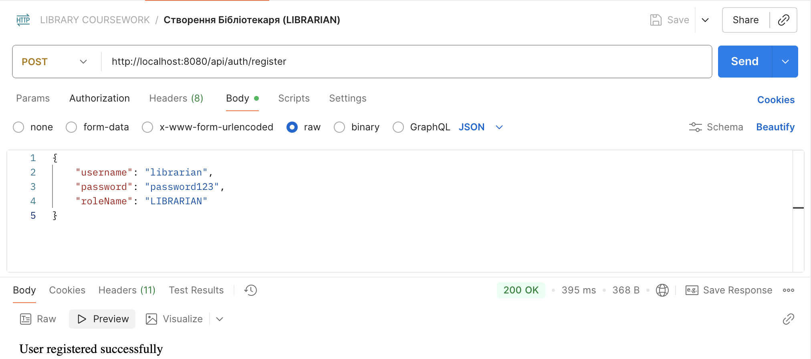
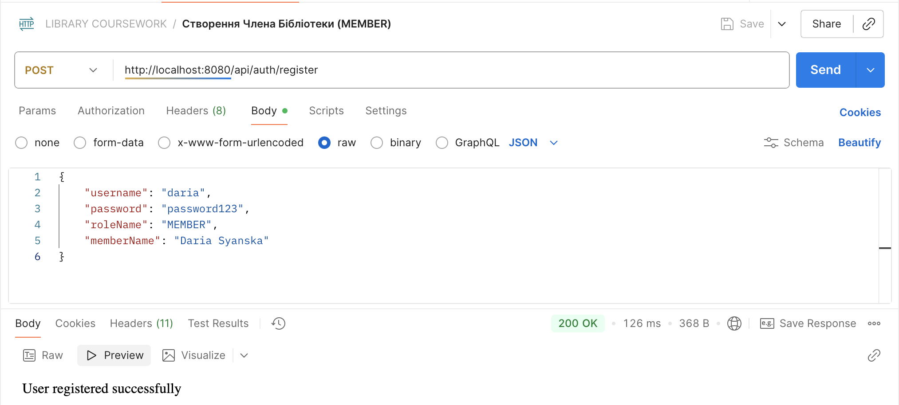
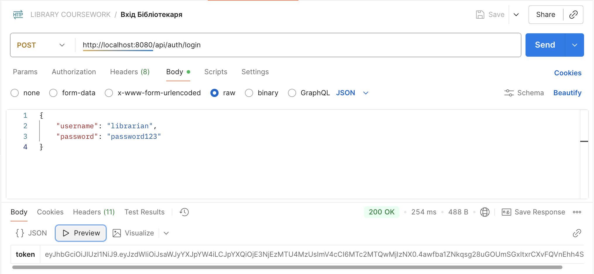
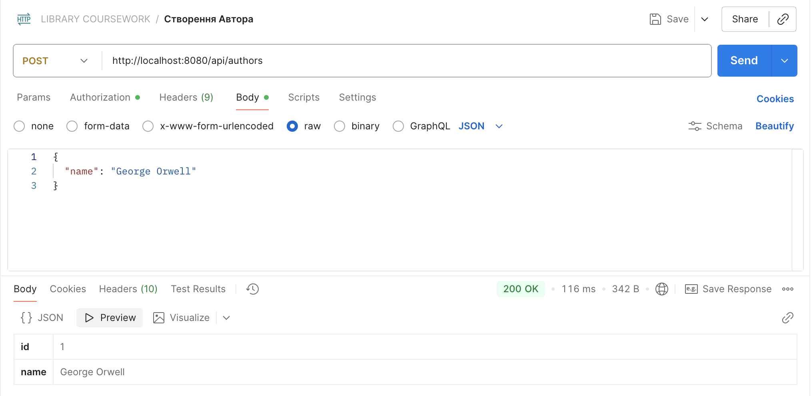
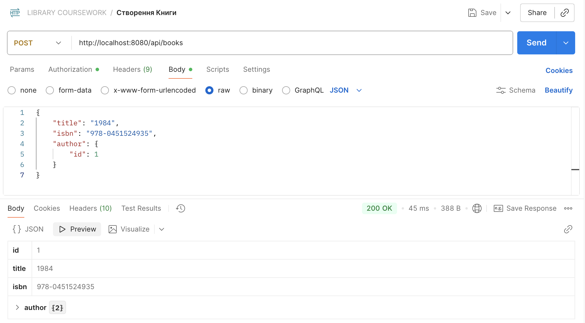
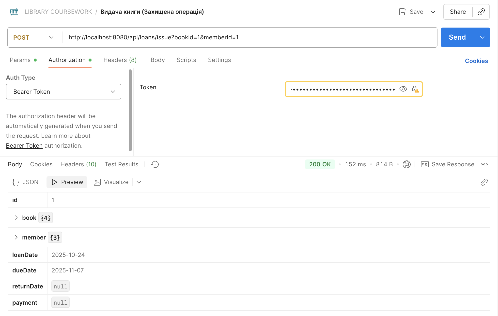
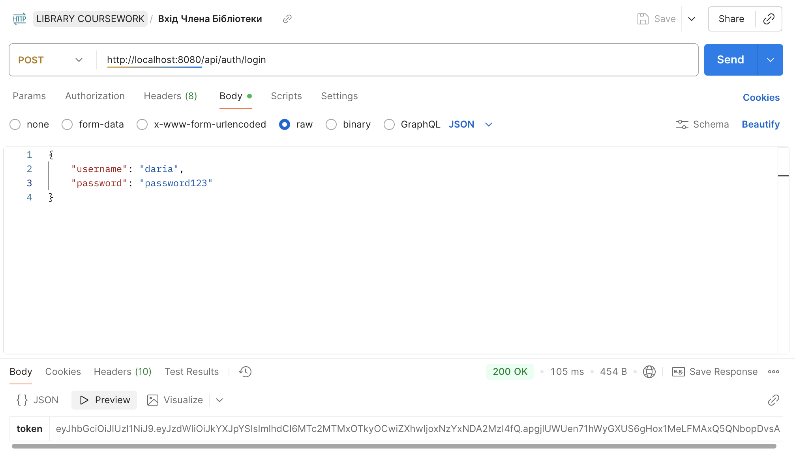
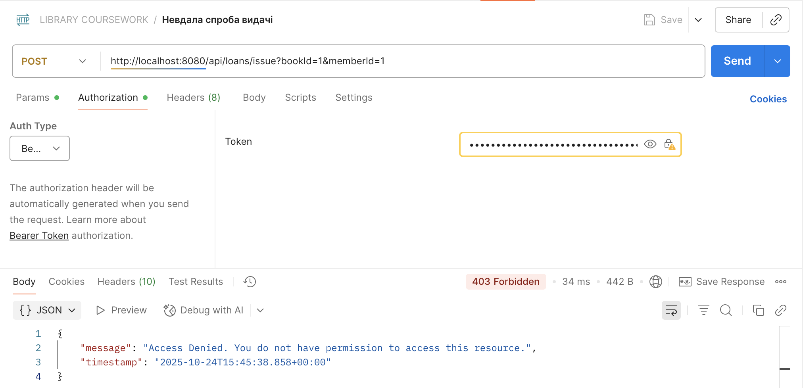
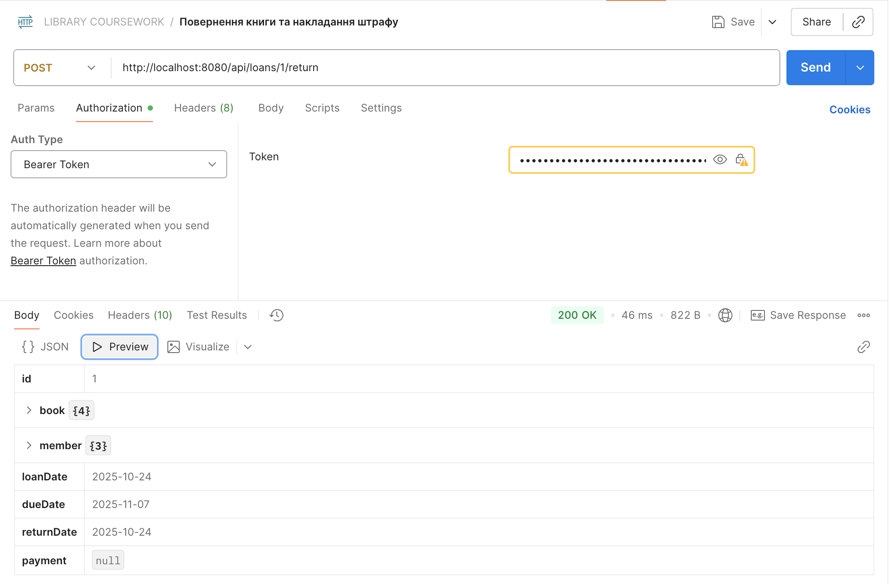
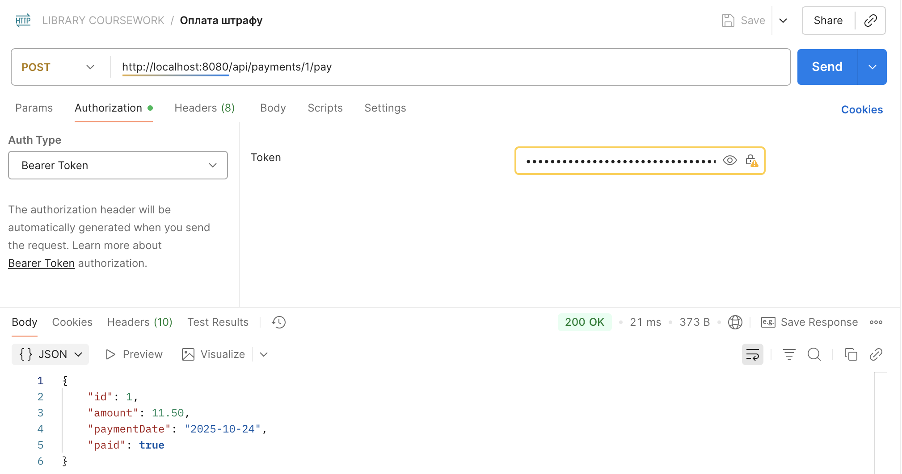

# Звіт до курсової роботи
## Тема: "Розробка корпоративного додатку з використанням Spring Boot"
### Варіант 4: Система управління бібліотекою

### Мета роботи:
Перевірити та закріпити навички розробки вебдодатків з використанням Spring MVC, Spring Data JPA та Spring Security. Оцінити здатність працювати з REST API, базами даних та безпекою через JWT.

### Використані технології:
* **Мова:** Java 17
* **Фреймворк:** Spring Boot 3
* **Безпека:** Spring Security, JWT (JSON Web Tokens)
* **Робота з даними:** Spring Data JPA, Hibernate
* **База даних:** H2 in-memory
* **Збірка проєкту:** Maven
* **Допоміжні бібліотеки:** Lombok

### Архітектура та модель даних:
Було розроблено 7 сутностей для моделювання системи управління бібліотекою:
* `User`: Обліковий запис користувача системи.
* `Role`: Ролі користувачів (`LIBRARIAN`, `MEMBER`).
* `Author`: Автор книги.
* `Book`: Книга, що має назву, ISBN та автора.
* `LibraryMember`: Член бібліотеки, пов'язаний з `User`.
* `Loan`: Сутність, що фіксує факт оренди книги членом бібліотеки (з датами видачі та повернення).
* `Payment`: Сутність для фіксації штрафів за прострочені книги.

**Відносини між сутностями:**
* `User` - `Role` (ManyToOne)
* `Book` - `Author` (ManyToOne)
* `LibraryMember` - `Loan` (OneToMany)
* `Loan` - `Book` (ManyToOne)
* `Loan` - `LibraryMember` (ManyToOne)
* `Loan` - `Payment` (OneToOne)

### Реалізовані REST-ендпоінти:
Було реалізовано понад 15 REST-запитів, включаючи повні CRUD-операції для основних сутностей та специфічну бізнес-логіку.

| Метод | URL-адреса                 | Опис                                      | Захист      |
| :---- | :------------------------- | :---------------------------------------- | :---------- |
| POST  | /api/auth/register         | Реєстрація нового користувача             | Публічний   |
| POST  | /api/auth/login            | Вхід в систему та отримання JWT           | Публічний   |
| POST  | /api/authors               | Створення нового автора                   | `LIBRARIAN` |
| GET   | /api/authors               | Отримання списку всіх авторів             | Публічний   |
| GET   | /api/authors/{id}          | Отримання автора за ID                    | Публічний   |
| POST  | /api/books                 | Створення нової книги                     | `LIBRARIAN` |
| GET   | /api/books                 | Отримання списку всіх книг                | Публічний   |
| POST  | /api/loans/issue           | **Видача книги члену бібліотеки** | `LIBRARIAN` |
| POST  | /api/loans/{id}/return     | **Повернення книги та накладання штрафу** | `LIBRARIAN` |
| POST  | /api/payments/{id}/pay     | Оплата штрафу                             | `MEMBER`    |
| GET   | /api/members               | Отримання списку членів бібліотеки        | `LIBRARIAN` |
| GET   | /api/members/{id}/loans    | Перегляд історії оренд члена бібліотеки   | `LIBRARIAN` |

*(та інші CRUD-операції для `Author`, `Book`, `Member`, `Loan`)*

### Логування та обробка помилок:
* Додано логування основних операцій (видача та повернення книг) за допомогою SLF4J.
* Реалізовано глобальний обробник помилок (`@RestControllerAdvice`) для коректного повернення статусів `404 Not Found`, `400 Bad Request` та `403 Forbidden`.

### Скріншоти тестування в Postman:

### Висновок:
У ході виконання курсової роботи було розроблено повноцінний REST-сервіс для системи управління бібліотекою. Я успішно застосувала на практиці всі основні технології курсу: Spring Boot для створення додатку, Spring Data JPA для роботи з базою даних, та Spring Security для реалізації надійної системи автентифікації та авторизації на основі ролей за допомогою JWT. Проєкт відповідає всім поставленим вимогам, включаючи складну модель даних, реалізацію понад 15 ендпоінтів та захист операцій за ролями.