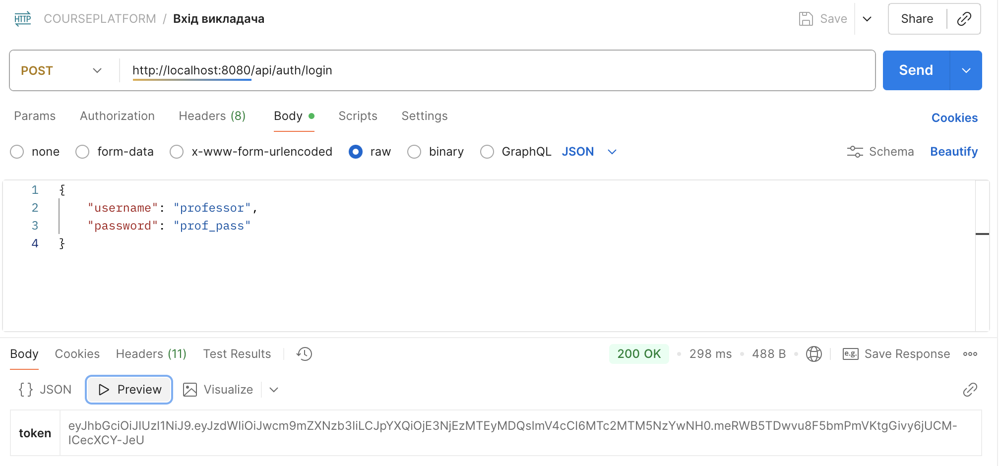
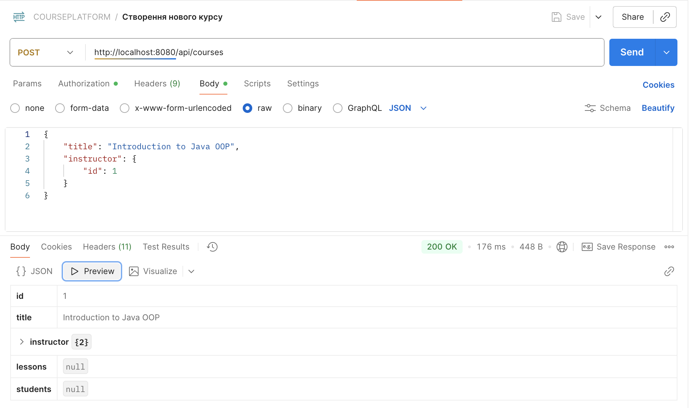
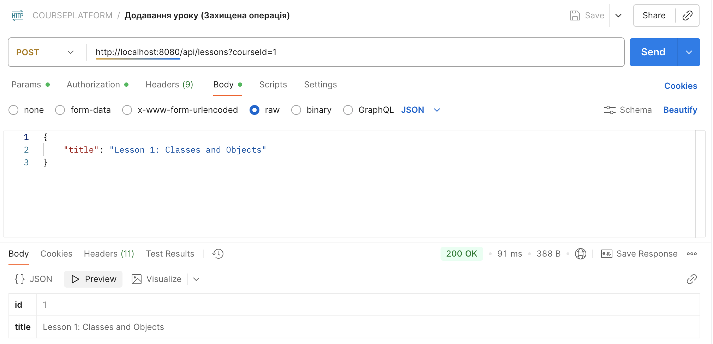
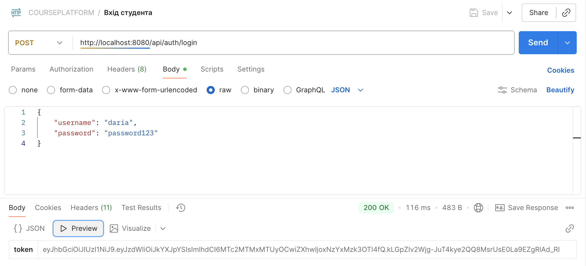
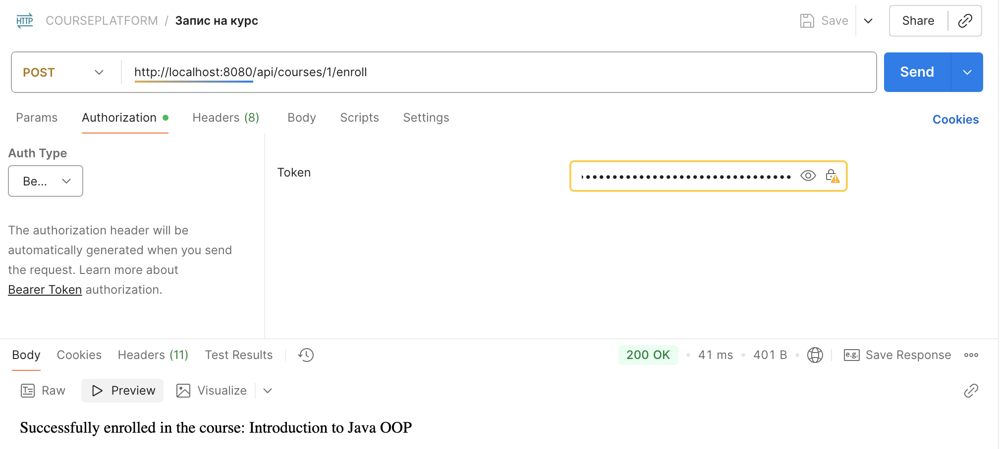
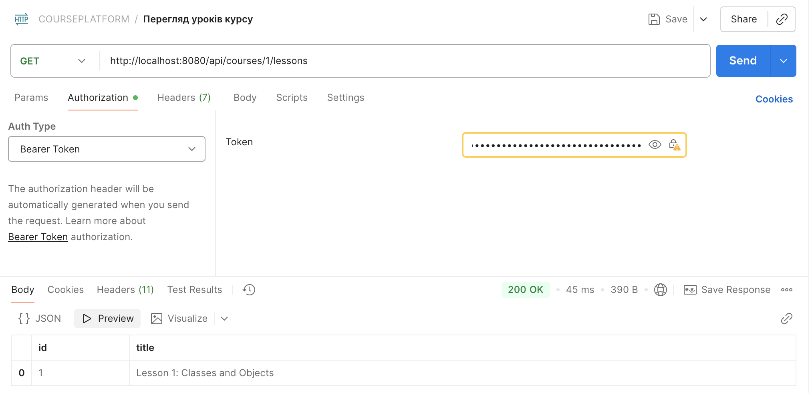
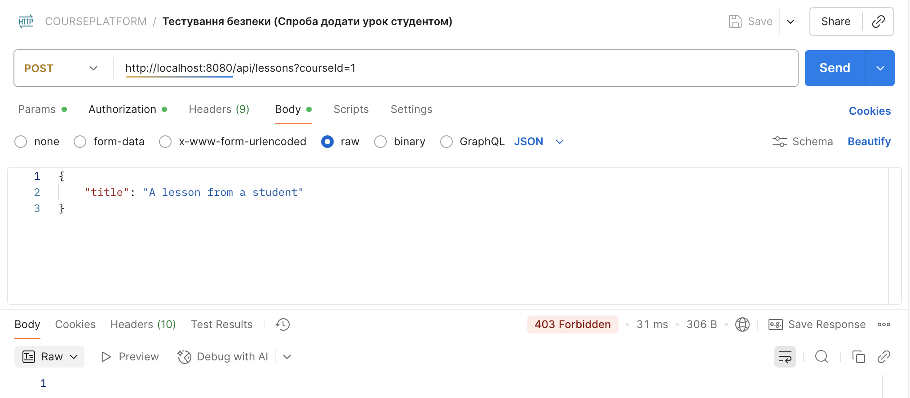

# Звіт до контрольної роботи
## Тема: "Розробка корпоративного додатку з використанням Spring Boot"
## Мета роботи: Перевірити та закріпити навички розробки вебдодатків з використанням Spring MVC, Spring Data JPA та Spring Security; оцінити здатність працювати з REST API, базами даних та безпекою через JWT.

### Виконання роботи:

1.  **Архітектура та модель даних**: Спроектовано архітектуру онлайн-платформи для курсів. Створено сутності `User`, `Student`, `Instructor`, `Course`, `Lesson` та `Role`. Налаштовано зв'язки між ними: `OneToOne` (User-Student), `OneToMany` (Instructor-Course, Course-Lesson) та `ManyToMany` (Student-Course).
2.  **Рівень безпеки**: Реалізовано повноцінну систему безпеки на базі Spring Security та JWT. Налаштовано автентифікацію (вхід за логіном/паролем) та авторизацію на основі ролей `STUDENT` та `INSTRUCTOR`.
3.  **REST API**: Розроблено REST-контролери для управління основними операціями:
* **Реєстрація та автентифікація**: Створено публічні ендпоінти для реєстрації нових користувачів (студентів та викладачів) і отримання JWT-токенів.
* **Управління курсами та уроками**: Реалізовано логіку додавання нових курсів, запису студентів на курси та перегляду уроків.
* **Захищені операції**: Захищено ендпоінт для додавання уроків (`POST /api/lessons`) — тепер ця дія доступна лише користувачам з роллю `INSTRUCTOR`, що було перевірено за допомогою `@PreAuthorize`.
4.  **Тестування**: Проведено комплексне тестування API за допомогою Postman. Було перевірено як позитивні сценарії (успішне створення курсів, запис на них), так і негативні (спроба студента додати урок), що підтвердило коректну роботу системи безпеки (отримано помилку `403 Forbidden`).

### Ключові скріншоти Postman:

### Висновок:

Під час виконання контрольної роботи я успішно застосувала та закріпила знання, отримані протягом курсу. Я реалізувала повноцінний RESTful-сервіс з нуля, включаючи складну модель даних, систему безпеки на базі ролей та JWT, а також захищені ендпоінти. Робота підтвердила моє вміння розробляти, тестувати та налагоджувати корпоративні додатки на Spring Boot.