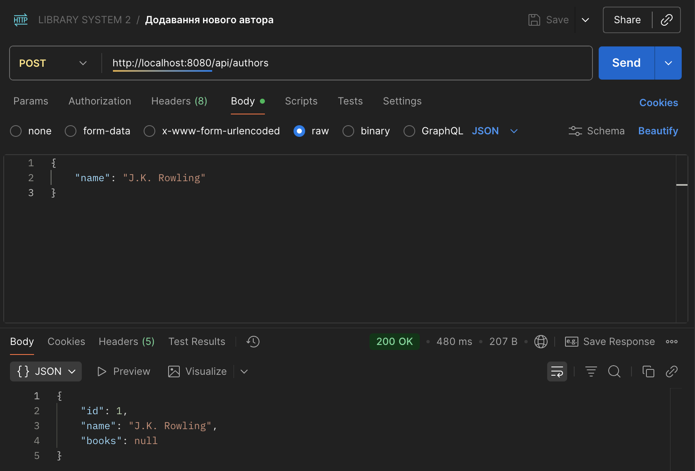
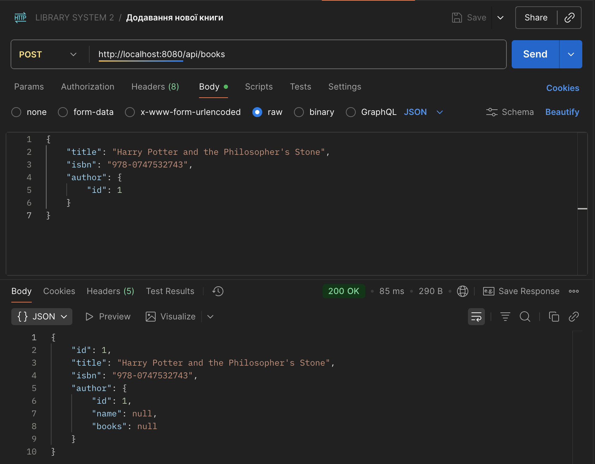
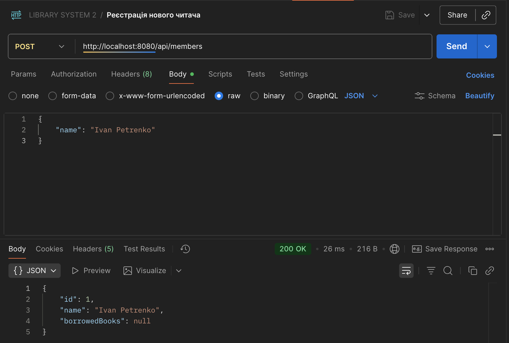
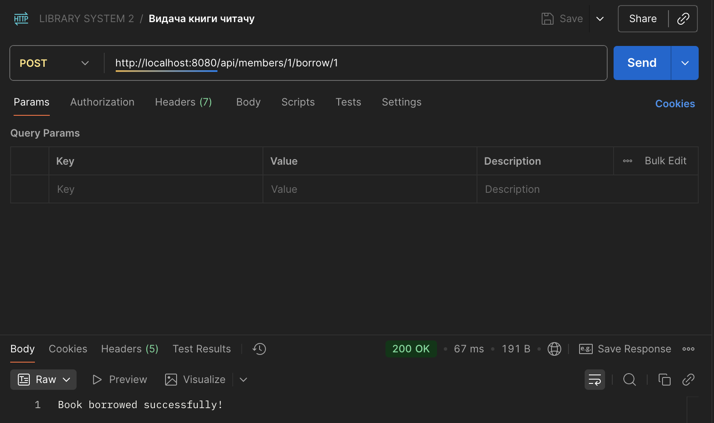

# Звіт до лабораторної роботи №1
## Тема: "Розробка простого корпоративного додатку за допомогою Java Spring"
## Мета роботи: Ознайомитись із основними компонентами фреймворку Spring, навчитись створювати базові додатки з використанням Spring Boot, реалізувати REST-контролери, інтегрувати базу даних за допомогою Spring Data JPA та виконувати CRUD-операції.

### Виконання роботи:

1. **Налаштування проєкту**: Був створений проєкт Spring Boot з залежностями Spring Web, Spring Data JPA, H2 та Lombok.
2. **Сутності**: Були створені класи-сутності `Book`, `Author`, `LibraryMember` з анотаціями JPA.
3. **Відносини**: Реалізовано зв'язки ManyToOne (Book-Author) та ManyToMany (LibraryMember-Book).
4. **Репозиторії**: Створено інтерфейси `BookRepository`, `AuthorRepository`, `LibraryMemberRepository`.
5. **Контролери**: Реалізовано REST-контролери для додавання авторів, книг, реєстрації читачів та видачі книг.
6. **Тестування**: Роботу API було перевірено за допомогою Postman.

### Скріншоти Postman:

### Висновок:

Під час виконання лабораторної роботи я ознайомилась з основами Spring Boot, навчилась створювати REST API та працювати з базою даних за допомогою Spring Data JPA.